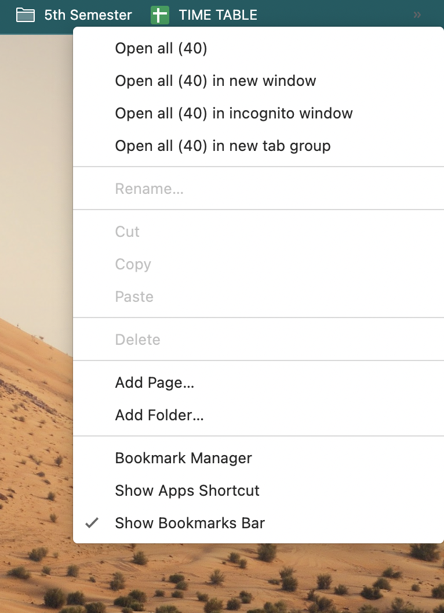
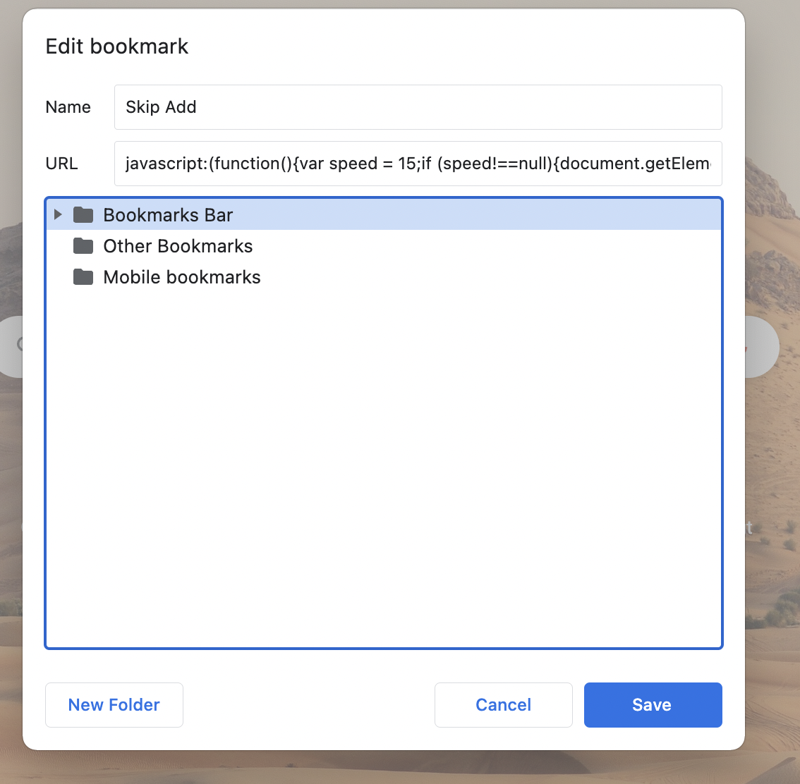

# Skip__Youtube__Ads
Tired of seeing long youtube ads ?  Neither want to install those add removal browser extensions which can read/write your crucial data ? Nor want to pay for add free youtube ?      No problem , just paste this short and simple javascript code in your browser bookmarks bar (i have used for chrome ) and skip those long ads .

Follow the below procedure to accomplish the task

<h3>Step 1</h3>
Right clcik the bookmarks tab on the top of your browser and select Add Page... option

<h3> Step 2 </h3>

Fill the following values in the corresponding sections

Name - Skip Add
URL  - javascript:(function(){var speed = 15;if (speed!==null){document.getElementsByClassName(%27html5-main-video%27)[0].playbackRate = speed;}})();

Click on Save 

Whenever you see a add on Youtube , just click this button on your browser bookmarks bar , the add will play in 15x speed .

